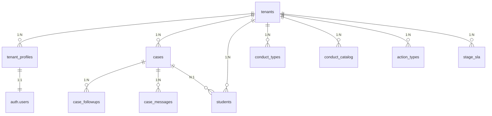

# Informe de Evaluación del Backend de Supabase

## Resumen Ejecutivo

Se realizó una evaluación exhaustiva del backend de Supabase conectado al proyecto. El sistema implementa una arquitectura multi-tenant con Row Level Security (RLS), pero se encontraron **diferencias significativas** entre el esquema del backend real y las migraciones locales.

---

## 1. Estado del Backend (Conexión MCP Exitosa)

### 1.1 Tablas Existentes

| Tabla | Registros | Estado |
|-------|-----------|--------|
| tenants | 1 | ✅ Activo |
| tenant_profiles | 0 | ⚠️ Sin usuarios |
| cases | 0 | ⚠️ Sin datos |
| students | 0 | ⚠️ Sin datos |
| case_followups | 0 | ⚠️ Sin datos |
| case_messages | 0 | ⚠️ Sin datos |
| conduct_catalog | 13 | ✅ Datos |
| conduct_types | 18 | ✅ Datos |
| action_types | 6 | ✅ Datos |
| stage_sla | 5 | ✅ Datos |
| tenant_branding | 1 | ✅ Configurado |
| tenant_domains | 1 | ✅ Configurado |
| tenant_audit_log | 2 | ✅ Auditoría |

### 1.2 Almacenamiento (Storage)

| Bucket | Estado |
|--------|--------|
| tenant-assets | ✅ Activo (0 archivos) |
| tenant-evidence | ✅ Activo (0 archivos) |

### 1.3 Autenticación

| Configuración | Valor |
|---------------|-------|
| Verificación de email | ✅ Requerida |
| Método de verificación | Código |
| Proveedores OAuth | ❌ No configurados |
| Longitud mínima password | 6 caracteres |

---

## 2. Análisis de Esquemas - Diferencias Críticas

### 2.1 Tabla `tenants`

**Backend real:**
```sql
- id, slug, legal_name, display_name, status
- subscription_plan, subscription_status
- primary_color, secondary_color, logo_url
- stripe_customer_id, stripe_subscription_id
```

**Migraciones locales:**
```sql
- id, slug, name, rut, address, phone, email
- timezone, locale, date_format, features
- max_students, max_users, max_cases_per_month, storage_mb
- trial_end_date, is_active, deleted_at
```

**Diferencia crítica:**
- Backend usa: `app.current_tenant_id()`
- Migraciones usan: `public.current_tenant_id()`

### 2.2 Tabla `cases`

**Backend real (genérico):**
```sql
- id, tenant_id, case_number, student_id
- title, description, status, priority, stage
- created_by, assigned_to, created_at, updated_at, closed_at
```

**Migraciones locales (específico escolar):**
```sql
- id, tenant_id, student_id, legacy_case_number
- incident_date, incident_time, course_incident
- conduct_type, conduct_category, short_description
- status (Reportado/En Seguimiento/Cerrado)
- indagacion_start_date, indagacion_due_date
- seguimiento_started_at, due_process_closed_at
- final_resolution_text, final_disciplinary_measure
```

**Impacto:** Las migraciones locales tienen campos específicos para gestión de convivencia escolar que no existen en el backend.

### 2.3 Tabla `tenant_profiles`

**Backend real:**
```sql
- id (PK), tenant_id (FK), email, full_name
- role: 'member' | 'project_admin'
- is_active, created_at, updated_at
```

**Migraciones locales:**
```sql
- role: 'platform_admin' | 'tenant_admin' | 'user' | 'readonly'
- phone, department, last_login_at
```

---

## 3. Políticas de Row Level Security (RLS)

### 3.1 Estado General

Todas las tablas principales tienen RLS habilitado.

### 3.2 Políticas de `cases` (Ejemplo)

```sql
-- SELECT: Filta por tenant del usuario
tenant_id IN (
  SELECT tenant_profiles.tenant_id 
  FROM tenant_profiles 
  WHERE tenant_profiles.id = auth.uid()
)

-- INSERT: Verifica tenant en el WITH CHECK
-- UPDATE: Mismo filtro que SELECT
```

### 3.3 Análisis de Seguridad

| Aspecto | Estado | Notas |
|---------|--------|-------|
| Aislamiento por tenant | ✅ | Usa subconsulta a tenant_profiles |
| Acceso solo a propios datos | ✅ | Correctamente implementado |
| Acceso admin | ✅ de permite | project_admin_policy todo |
| Trigger updated_at | ✅ | trg_tenants_touch_updated_at |

---

## 4. Funciones y RPCs

### 4.1 Funciones de Esquema (app.)

El backend usa funciones del esquema `app.`:
- `app.current_tenant_id()` - Obtener tenant actual
- `app.jwt_claim()` - Obtener claims del JWT
- `app.touch_updated_at()` - Trigger de updated_at

### 4.2 Diferencia con Migraciones Locales

Las migraciones locales definen funciones en `public.`:
- `public.current_tenant_id()`
- `public.is_platform_admin()`
- `public.is_tenant_admin()`
- `public.can_access_tenant()`

**Esto indica que las migraciones locales NO se han aplicado al backend.**

---

## 5. Relaciones Entre Tablas



---

## 6. Evaluación de Integridad y Diseño

### 6.1 Fortalezas

1. ✅ **Arquitectura multi-tenant bien implementada**
2. ✅ **RLS habilitado en todas las tablas**
3. ✅ **Foreign keys con cascade delete**
4. ✅ **Índices para optimización por tenant**
5. ✅ **Esquema de auditoría (tenant_audit_log)**
6. ✅ **Sistema de storage configurado**

### 6.2 Debilidades Identificadas

1. ⚠️ **Desincronización entre migraciones locales y backend**
   - Las migraciones locales no se han aplicado
   - Esquemas diferentes para cases, tenants, profiles

2. ⚠️ **Falta de datos de prueba**
   - 0 casos, 0 estudiantes, 0 seguimientos

3. ⚠️ **Roles limitados**
   - Solo 'member' y 'project_admin' vs 'platform_admin', 'tenant_admin', 'user', 'readonly'

4. ⚠️ **Campos faltantes**
   - No hay campos específicos de convivencia escolar (conduct_type, conduct_category, etc.)

---

## 7. Recomendaciones

### 7.1 Acciones Inmediatas

| # | Acción | Prioridad |
|---|--------|-----------|
| 1 | Sincronizar migraciones locales con el backend | CRÍTICA |
| 2 | Aplicar esquema completo de cases (incident_date, conduct_type, etc.) | CRÍTICA |
| 3 | Crear datos de prueba para validar funcionalidad | ALTA |
| 4 | Agregar campos faltantes a tenants (rut, address, etc.) | MEDIA |

### 7.2 Mejoras de Seguridad

1. Implementar función `public.current_tenant_id()` que llame a `app.current_tenant_id()`
2. Agregar políticas específicas para tenant_admin
3. Configurar auditoría completa

### 7.3 Integración con Frontend

El frontend tiene consultas que esperan campos específicos:
- `incident_date`, `incident_time`
- `conduct_type`, `conduct_category`
- `short_description`
- `course_incident`

**Estos campos NO existen en el backend actual.**

---

## 8. Conclusión

| Aspecto | Evaluación |
|---------|------------|
| Estado general | ⚠️ Parcialmente configurado |
| Coherencia migraciones-backend | ❌ Desincronizado |
| RLS y seguridad | ✅ Implementado correctamente |
| Esquema de datos | ⚠️ Genérico vs específico |
| Datos de prueba | ❌ No hay datos |

**El backend está funcional pero desincronizado con las migraciones locales.** Se requiere aplicar las migraciones o adaptar el código frontend al esquema actual.

### siguiente paso recomendado

1. Ejecutar las migraciones locales en el backend, o
2. Adaptar el esquema del frontend al backend actual (menos recomendado por pérdida de funcionalidad escolar)
