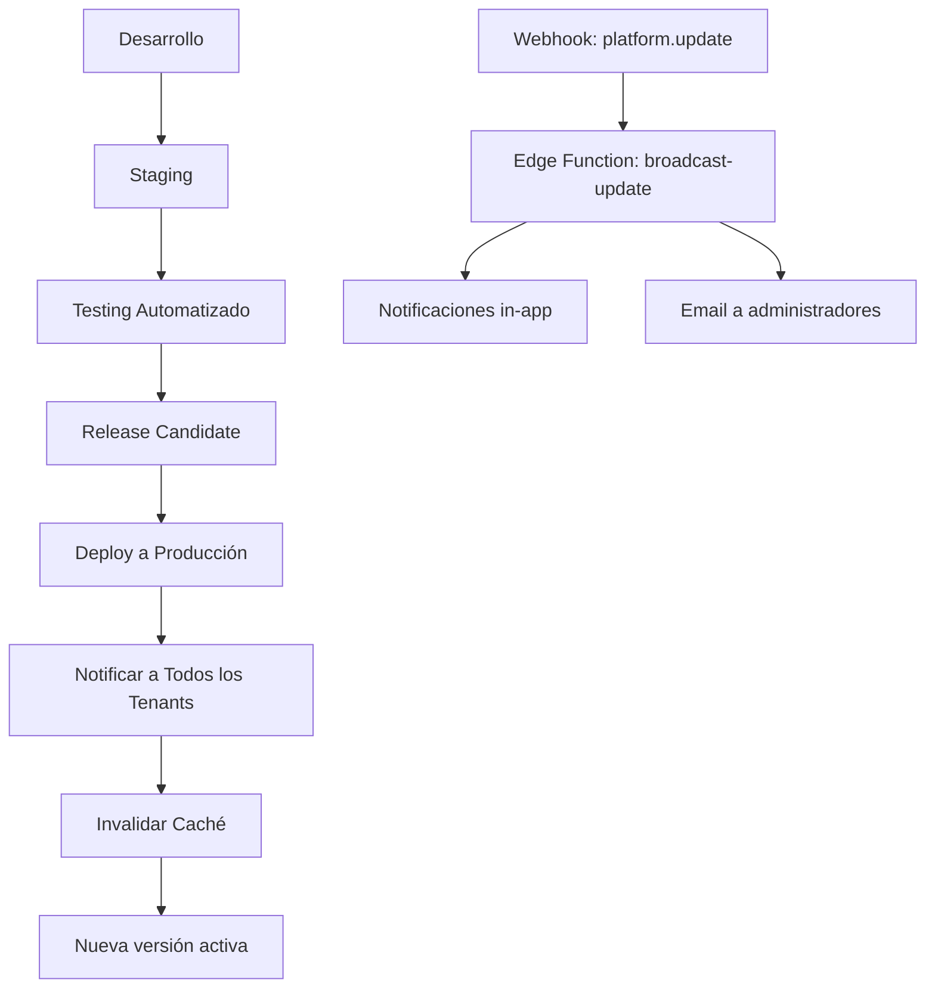
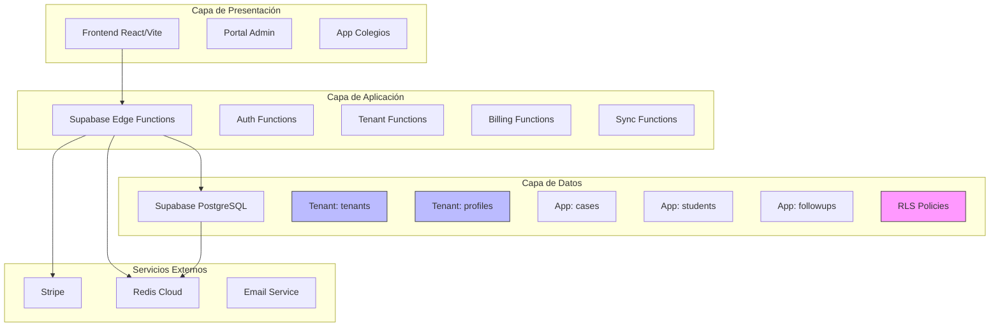

# Plan de Arquitectura: Plataforma SaaS Multi-Tenant para Gestión de Convivencia Escolar

## Visión General del Proyecto

Transformar el sistema actual de gestión de casos de convivencia escolar en una plataforma SaaS multi-tenant escalable que permita a múltiples colegios utilizar el sistema desde un único backend centralizado, con actualizaciones automáticas simultáneas para todos los clientes.

---

## Supuestos de Diseño

- **Modelo de tenencia**: Filas por tenant (shared database, shared schema) con RLS para aislamiento
- **Acceso**: Subdominios por institución (colegio1.plataforma.com)
- **Pagos**: Stripe como procesador principal
- **Caché**: Redis (configuración externa)
- **Producto base**: El sistema actual de casos será el producto estándar para todos los clientes

---

## FASE 1: Arquitectura de Base de Datos Multi-Tenant

### 1.1 Nuevas Tablas para Multi-Tenancy

```sql
-- Tenants (Colegios)
CREATE TABLE tenants (
  id UUID PRIMARY KEY DEFAULT uuid_generate_v4(),
  slug TEXT UNIQUE NOT NULL, -- identificador para subdominio
  name TEXT NOT NULL,
  rut TEXT, -- RUT del establecimiento
  address TEXT,
  phone TEXT,
  email TEXT,
  logo_url TEXT,
  primary_color TEXT DEFAULT '#2563eb',
  secondary_color TEXT DEFAULT '#1e40af',
  
  -- Configuración de suscripción
  subscription_status TEXT DEFAULT 'trial',
  subscription_plan TEXT DEFAULT 'basic',
  stripe_customer_id TEXT,
  stripe_subscription_id TEXT,
  trial_end_date TIMESTAMPTZ,
  
  -- Configuración regional
  timezone TEXT DEFAULT 'America/Santiago',
  locale TEXT DEFAULT 'es-CL',
  
  -- Metadatos
  created_at TIMESTAMPTZ DEFAULT NOW(),
  updated_at TIMESTAMPTZ DEFAULT NOW(),
  deleted_at TIMESTAMPTZ
);

-- Usuarios con pertenencia a tenant
CREATE TABLE profiles (
  id UUID REFERENCES auth.users(id) ON DELETE CASCADE,
  tenant_id UUID REFERENCES tenants(id) ON DELETE CASCADE NOT NULL,
  email TEXT NOT NULL,
  full_name TEXT,
  role TEXT NOT NULL DEFAULT 'user', -- platform_admin, tenant_admin, user
  avatar_url TEXT,
  is_active BOOLEAN DEFAULT TRUE,
  created_at TIMESTAMPTZ DEFAULT NOW(),
  updated_at TIMESTAMPTZ DEFAULT NOW(),
  PRIMARY KEY (id, tenant_id)
);

-- Catálogos por tenant
CREATE TABLE tenant_catalogs (
  id UUID PRIMARY KEY DEFAULT uuid_generate_v4(),
  tenant_id UUID REFERENCES tenants(id) ON DELETE CASCADE NOT NULL,
  catalog_type TEXT NOT NULL, -- conduct_types, courses, levels, etc.
  key TEXT NOT NULL,
  value JSONB NOT NULL,
  display_order INTEGER DEFAULT 0,
  is_active BOOLEAN DEFAULT TRUE,
  created_at TIMESTAMPTZ DEFAULT NOW(),
  updated_at TIMESTAMPTZ DEFAULT NOW(),
  UNIQUE(tenant_id, catalog_type, key)
);

-- Configuraciones por tenant
CREATE TABLE tenant_settings (
  id UUID PRIMARY KEY DEFAULT uuid_generate_v4(),
  tenant_id UUID REFERENCES tenants(id) ON DELETE CASCADE NOT NULL,
  setting_key TEXT NOT NULL,
  setting_value JSONB NOT NULL,
  created_at TIMESTAMPTZ DEFAULT NOW(),
  updated_at TIMESTAMPTZ DEFAULT NOW(),
  UNIQUE(tenant_id, setting_key)
);
```

### 1.2 Modificación de Tablas Existentes

Agregar `tenant_id` como foreign key a todas las tablas de datos:

```sql
-- Añadir tenant_id a tablas existentes
ALTER TABLE students ADD COLUMN tenant_id UUID REFERENCES tenants(id);
ALTER TABLE cases ADD COLUMN tenant_id UUID REFERENCES tenants(id);
ALTER TABLE case_followups ADD COLUMN tenant_id UUID REFERENCES tenants(id);
ALTER TABLE followup_evidence ADD COLUMN tenant_id UUID REFERENCES tenants(id);
ALTER TABLE process_stages ADD COLUMN tenant_id UUID REFERENCES tenants(id);
ALTER TABLE stage_sla ADD COLUMN tenant_id UUID REFERENCES tenants(id);
ALTER TABLE involucrados ADD COLUMN tenant_id UUID REFERENCES tenants(id);
ALTER TABLE conduct_catalog ADD COLUMN tenant_id UUID REFERENCES tenants(id);
ALTER TABLE conduct_types ADD COLUMN tenant_id UUID REFERENCES tenants(id);
```

---

## FASE 2: Row Level Security (RLS)

### 2.1 Políticas RLS por Tabla

```sql
-- Función helper para obtener el tenant_id del usuario actual
CREATE OR REPLACE FUNCTION auth.tenant_id()
RETURNS UUID AS $$
  SELECT tenant_id::UUID
  FROM profiles
  WHERE id = auth.uid()
  LIMIT 1;
$$ LANGUAGE SQL STABLE SECURITY DEFINER;

-- Función para verificar rol de administrador de plataforma
CREATE OR REPLACE FUNCTION auth.is_platform_admin()
RETURNS BOOLEAN AS $$
  SELECT EXISTS (
    SELECT 1 FROM profiles
    WHERE id = auth.uid() AND role = 'platform_admin'
  );
$$ LANGUAGE SQL STABLE SECURITY DEFINER;

-- Ejemplo de política para tabla cases
CREATE POLICY tenant_isolation_cases ON cases
  FOR ALL
  USING (
    tenant_id = auth.tenant_id()
    OR auth.is_platform_admin() = TRUE
  );

-- Políticas similares para todas las demás tablas de tenant
```

### 2.2 Roles y Permisos

```sql
-- Roles de plataforma
CREATE TYPE platform_role AS ENUM ('platform_admin', 'tenant_admin', 'user');

-- Tabla de permisos por rol
CREATE TABLE role_permissions (
  id UUID PRIMARY KEY DEFAULT uuid_generate_v4(),
  role TEXT NOT NULL,
  table_name TEXT NOT NULL,
  can_select BOOLEAN DEFAULT FALSE,
  can_insert BOOLEAN DEFAULT FALSE,
  can_update BOOLEAN DEFAULT FALSE,
  can_delete BOOLEAN DEFAULT FALSE,
  UNIQUE(role, table_name)
);
```

---

## FASE 3: Edge Functions y Webhooks

### 3.1 Edge Functions Requeridas

```
functions/
├── tenant/
│   ├── create-tenant/
│   │   └── index.ts          -- Crear nuevo colegio
│   ├── update-tenant/
│   │   └── index.ts          -- Actualizar configuración
│   ├── get-tenant/
│   │   └── index.ts          -- Obtener datos del tenant
│   └── switch-tenant/
│       └── index.ts          -- Cambiar entre tenants (super admin)
├── auth/
│   ├── on-auth-hook/
│   │   └── index.ts          -- Crear perfil al registrar usuario
│   └── verify-tenant-access/
│       └── index.ts          -- Verificar acceso del usuario
├── billing/
│   ├── stripe-webhook/
│   │   └── index.ts          -- Procesar eventos de Stripe
│   ├── create-subscription/
│   │   └── index.ts          -- Crear suscripción
│   ├── cancel-subscription/
│   │   └── index.ts          -- Cancelar suscripción
│   └── sync-subscription/
│       └── index.ts          -- Sincronizar estado con Stripe
├── sync/
│   ├── broadcast-update/
│   │   └── index.ts          -- Notificar actualización a todos
│   └── catalog-sync/
│       └── index.ts          -- Sincronizar catálogos
└── cache/
    ├── invalidate-tenant/
    │   └── index.ts          -- Invalidar caché del tenant
    └── warm-tenant/
        └── index.ts          -- Pre-calentar caché
```

### 3.2 Webhooks配置

```typescript
// Eventos de webhook a configurar
const WEBHOOK_EVENTS = {
  // Auth events
  'user.created': 'sync-user-to-profiles',
  'user.updated': 'update-profile',
  'user.deleted': 'deactivate-profile',
  
  // Tenant events
  'tenant.created': 'initialize-tenant-resources',
  'tenant.updated': 'sync-tenant-settings',
  'tenant.deleted': 'soft-delete-tenant-data',
  
  // Billing events (Stripe)
  'customer.subscription.created': 'activate-subscription',
  'customer.subscription.updated': 'update-subscription',
  'customer.subscription.deleted': 'downgrade-or-suspend',
  'invoice.payment_failed': 'notify-payment-failure',
  
  // Platform events
  'platform.update-released': 'broadcast-update',
};
```

---

## FASE 4: Optimización de Consultas e Índices

### 4.1 Índices Compuestos para Multi-Tenant

```sql
-- Índices tenant-aware para optimización
CREATE INDEX idx_cases_tenant_status ON cases(tenant_id, status);
CREATE INDEX idx_cases_tenant_date ON cases(tenant_id, incident_date DESC);
CREATE INDEX idx_students_tenant ON students(tenant_id, level, course);
CREATE INDEX idx_followups_tenant_case ON case_followups(tenant_id, case_id);

-- Índices para búsquedas full-text por tenant
CREATE INDEX idx_students_fts_tenant ON students 
  USING GIN (to_tsvector('spanish', coalesce(first_name,'') || ' ' || coalesce(last_name,'')));

-- Índice para búsquedas por slug de tenant
CREATE INDEX idx_tenants_slug ON tenants(slug) WHERE deleted_at IS NULL;

-- Índice para búsquedas de usuarios por tenant
CREATE INDEX idx_profiles_tenant ON profiles(tenant_id, email);
```

### 4.2 Vistas Materializadas

```sql
-- Vista de estadísticas por tenant (cacheable)
CREATE MATERIALIZED VIEW tenant_stats AS
SELECT 
  t.id as tenant_id,
  t.name as tenant_name,
  COUNT(c.id) as total_cases,
  COUNT(CASE WHEN c.status = 'Reportado' THEN 1 END) as casos_reportados,
  COUNT(CASE WHEN c.status = 'En Seguimiento' THEN 1 END) as casos_en_seguimiento,
  COUNT(CASE WHEN c.status = 'Cerrado' THEN 1 END) as casos_cerrados,
  COUNT(CASE WHEN c.conduct_category = 'Gravísima' THEN 1 END) as casos_gravisima,
  MAX(c.created_at) as ultimo_caso
FROM tenants t
LEFT JOIN cases c ON c.tenant_id = t.id AND c.deleted_at IS NULL
WHERE t.deleted_at IS NULL
GROUP BY t.id, t.name;

-- Índice para刷新 de estadísticas
CREATE UNIQUE INDEX idx_tenant_stats ON tenant_stats(tenant_id);
```

---

## FASE 5: Sistema de Suscripciones y Facturación

### 5.1 Planes de Suscripción

```typescript
const SUBSCRIPTION_PLANS = {
  basic: {
    name: 'Básico',
    price_monthly: 9.90, // USD
    price_yearly: 99.00,
    features: {
      max_students: 500,
      max_users: 10,
      max_cases_per_month: 100,
      storage_mb: 1000,
      support: 'email',
      analytics: 'basic',
    },
    stripe_price_id_monthly: 'price_xxx',
    stripe_price_id_yearly: 'price_yyy',
  },
  professional: {
    name: 'Profesional',
    price_monthly: 29.90,
    price_yearly: 299.00,
    features: {
      max_students: 2000,
      max_users: 50,
      max_cases_per_month: 500,
      storage_mb: 5000,
      support: 'priority',
      analytics: 'advanced',
      custom_reports: true,
    },
  },
  enterprise: {
    name: 'Empresarial',
    price_monthly: 99.90,
    price_yearly: 999.00,
    features: {
      max_students: -1, // ilimitado
      max_users: -1,
      max_cases_per_month: -1,
      storage_mb: 50000,
      support: 'dedicated',
      analytics: 'full',
      custom_reports: true,
      api_access: true,
      sso: true,
    },
  },
};
```

### 5.2 Edge Function de Facturación

```typescript
// functions/billing/stripe-webhook/index.ts
export default async (req: Request) => {
  const sig = req.headers.get('stripe-signature');
  const webhookSecret = Deno.env.get('STRIPE_WEBHOOK_SECRET');
  
  let event: Stripe.Event;
  try {
    event = await stripe.webhooks.constructEventAsync(
      await req.text(),
      sig,
      webhookSecret
    );
  } catch (err) {
    return new Response(`Webhook Error: ${err.message}`, { status: 400 });
  }

  switch (event.type) {
    case 'customer.subscription.created':
    case 'customer.subscription.updated':
      await handleSubscriptionChange(event.data.object as Stripe.Subscription);
      break;
    case 'invoice.payment_failed':
      await handlePaymentFailure(event.data.object as Stripe.Invoice);
      break;
  }

  return new Response(JSON.stringify({ received: true }), { status: 200 });
};
```

---

## FASE 6: Escalabilidad y Alta Disponibilidad

### 6.1 Caché con Redis

```typescript
// lib/redis.ts
import { createClient } from 'redis';

const redis = createClient({
  url: process.env.REDIS_URL,
  socket: {
    reconnectStrategy: (retries) => {
      if (retries > 10) return new Error('Redis reconnection failed');
      return Math.min(retries * 100, 3000);
    },
  },
});

// Estrategias de caché
const CACHE_STRATEGIES = {
  // Cachear stats de tenant por 5 minutos
  tenant_stats: { ttl: 300, prefix: 'tenant:stats:' },
  
  // Cachear catálogos por 1 hora
  catalogs: { ttl: 3600, prefix: 'tenant:catalogs:' },
  
  // Cachear configuración por 10 minutos
  settings: { ttl: 600, prefix: 'tenant:settings:' },
  
  // Cachear lista de usuarios por tenant por 2 minutos
  users: { ttl: 120, prefix: 'tenant:users:' },
};
```

### 6.2 Escalabilidad Horizontal

```yaml
# docker-compose.yml para desarrollo local
services:
  supabase:
    image: supabase/postgres
    environment:
      - POSTGRES_HOST_AUTH_METHOD=trust
    volumes:
      - ./supabase/init.sql:/docker-entrypoint-initdb.d/init.sql
  
  redis:
    image: redis:7-alpine
    command: redis-server --appendonly yes
    volumes:
      - redis-data:/data
  
  # Para producción: Supabase Cloud + Redis Cloud
```

### 6.3 Alta Disponibilidad

```sql
-- Configuración de replicación en Supabase (Pro Plan)
-- El plan Pro incluye:
-- - Replicas de lectura
-- - Conexiones simultáneas: 200
-- - Autoescalamiento

-- Para pool de conexiones
-- Usar PgBouncer en Supabase para manejar múltiples conexiones
```

---

## FASE 7: Sistema de Actualizaciones Automáticas

### 7.1 Arquitectura de Updates



### 7.2 Control de Versiones por Tenant

```sql
CREATE TABLE platform_versions (
  id UUID PRIMARY KEY DEFAULT uuid_generate_v4(),
  version TEXT NOT NULL,
  release_date TIMESTAMPTZ DEFAULT NOW(),
  features JSONB DEFAULT '[]',
  breaking_changes JSONB DEFAULT '[]',
  is_active BOOLEAN DEFAULT TRUE,
  is_mandatory BOOLEAN DEFAULT FALSE
);

CREATE TABLE tenant_versions (
  id UUID PRIMARY KEY DEFAULT uuid_generate_v4(),
  tenant_id UUID REFERENCES tenants(id),
  version_id UUID REFERENCES platform_versions(id),
  applied_at TIMESTAMPTZ DEFAULT NOW(),
  auto_update_enabled BOOLEAN DEFAULT TRUE
);
```

---

## FASE 8: Frontend Multi-Tenant

### 8.1 Routing por Tenant

```typescript
// Routing basado en subdominio
const getTenantFromSubdomain = (hostname: string): string | null => {
  const parts = hostname.split('.');
  if (parts.length >= 3 && parts[0] !== 'www') {
    return parts[0]; // colegio1.plataforma.com -> "colegio1"
  }
  return null;
};

// Configuración de rutas
const router = createBrowserRouter([
  {
    path: '/:tenantSlug/*',
    loader: async ({ params }) => {
      const tenant = await fetchTenantBySlug(params.tenantSlug);
      if (!tenant) throw new Response('Colegio no encontrado', { status: 404 });
      return { tenant };
    },
    children: [...routes],
  },
]);
```

### 8.2 Autenticación y Autorización

```typescript
// Proveedor de contexto de tenant
const TenantProvider: React.FC<{ children: React.ReactNode }> = ({ children }) => {
  const { data: session } = useSession();
  const [tenant, setTenant] = useState<Tenant | null>(null);
  
  useEffect(() => {
    if (session?.user) {
      fetchTenantProfile(session.user.id).then(setTenant);
    }
  }, [session]);

  return (
    <TenantContext.Provider value={{ tenant, setTenant }}>
      {children}
    </TenantContext.Provider>
  );
};
```

---

## FASE 9: Implementación - Orden de Ejecución

### Paso 1: Migraciones de Base de Datos
- [ ] 17_tenants_and_profiles.sql - Tablas principales de multi-tenancy
- [ ] 18_add_tenant_id_existing_tables.sql - Añadir tenant_id a tablas existentes
- [ ] 19_tenant_indexes.sql - Índices para optimización
- [ ] 20_tenant_rls_policies.sql - Políticas RLS
- [ ] 21_tenant_functions.sql - Funciones helper
- [ ] 22_tenant_seed.sql - Datos de seed

### Paso 2: Edge Functions
- [ ] Crear functions/tenant/
- [ ] Crear functions/auth/
- [ ] Crear functions/billing/
- [ ] Configurar webhooks de Stripe

### Paso 3: Frontend
- [ ] Adaptar App.tsx para routing multi-tenant
- [ ] Crear componentes de tenant selection
- [ ] Implementar theming por tenant
- [ ] Añadir portal de administración

### Paso 4: Integración de Pagos
- [ ] Configurar Stripe
- [ ] Crear portal de facturación
- [ ] Implementar webhooks de pagos

### Paso 5: Caché y Performance
- [ ] Configurar Redis
- [ ] Implementar capa de caché
- [ ] Optimizar queries

### Paso 6: Testing y Deploy
- [ ] Tests de integración multi-tenant
- [ ] Deploy a producción
- [ ] Monitoreo y alertas

---

## Diagrama de Arquitectura



---

## Consideraciones de Seguridad

1. **Aislamiento de datos**: RLS garantiza que cada tenant solo vea sus datos
2. **Validación de dominio**: Verificar que el subdominio pertenece al tenant correcto
3. **Rate limiting**: Implementar en Edge Functions
4. **Auditoría**: Logs de todas las operaciones sensibles
5. **Encriptación**: TLS en tránsito, datos sensibles en reposo
6. **Backups**: Configurar retention policy por tenant

---

## Métricas y Monitoreo

- Latencia de queries por tenant
- Usage de API por tenant
- Uptime y disponibilidad
- Errors y excepciones
- Uso de almacenamiento
- Métricas de facturación
